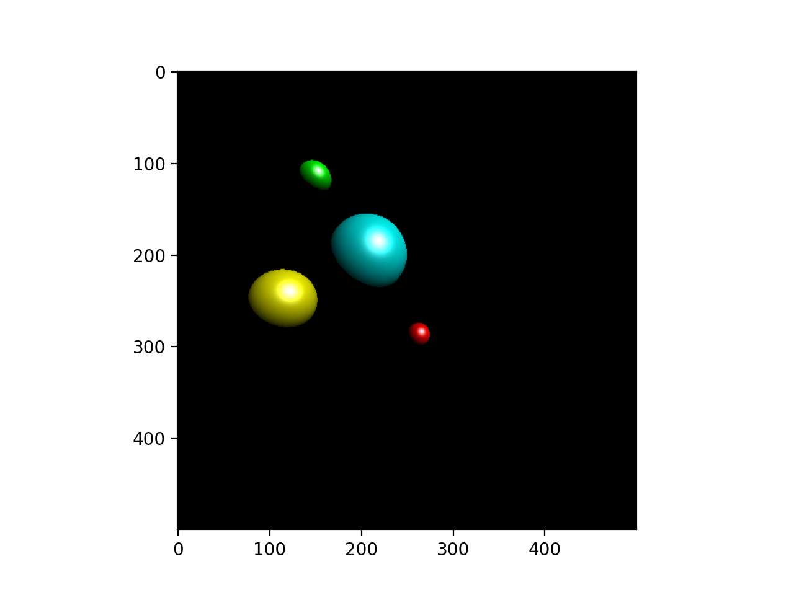

# 3D Ray Tracer

This program uses ray tracing algorithms to render illuminated spheres. 

## Background
To create more realistic images of objects, we can follow a light vector from the camera point through a pixel and then simulate its interactions
with the scene. Tracing each vector helps to determine what color to associate to each pixel. This program operates on a 500 x 500 grid of pixels.

## Usage

Before using, make sure to have Python 3, NumPy, and Matplotlib installed on your computer.

To run, simply run main.py on the Python interpreter.
The program generates the following image.

